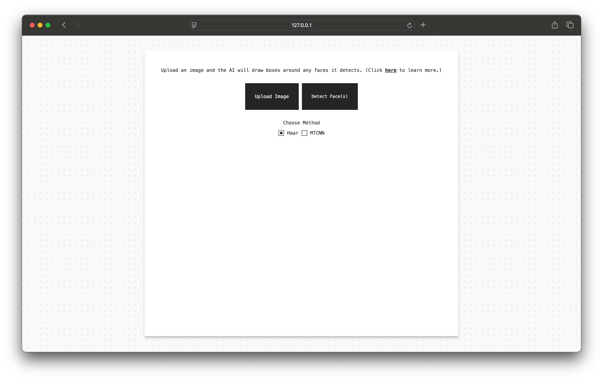
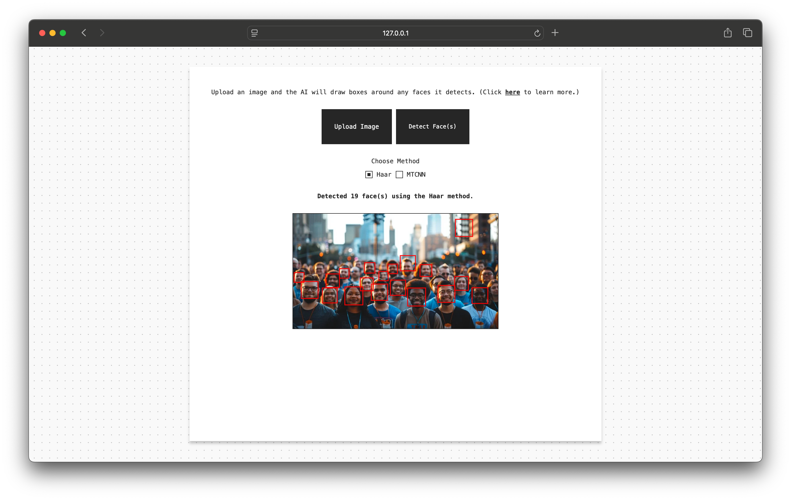
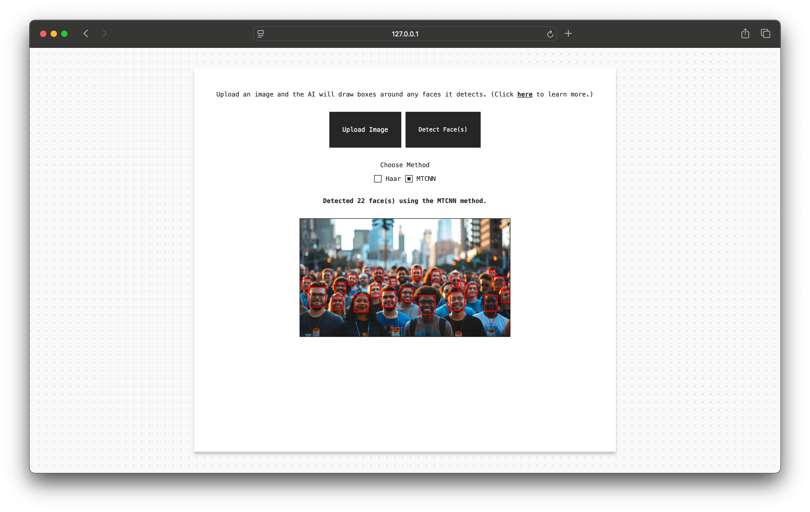

# Face Detection Web App

A Flask-based web application for detecting faces in images using two methods: Haar Cascades (OpenCV) and MTCNN (deep learning). Users can upload an image, select a detection method, and view results directly in the browser.

## Setup

### 1. Clone the repository

git clone https://github.com/Zacharyrg25/face-recognition-website.git

cd face-recognition-website

### 2. Create a virtual environment

python3.12 -m venv .venv

### 3. Activate the virtual environment

Mac/Linux: source .venv/bin/activate  

Windows: .venv\Scripts\activate  

### 4. Install dependencies

pip install -r requirements.txt

### 5. Run the app

python app.py

### 6. Open in browser

## Stack

- Python
- Flask
- OpenCV
- NumPy
- MTCNN
- TensorFlow
- JavaScript (Canvas API)